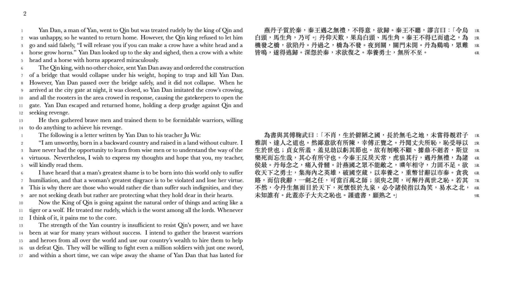

# rosetta-gpt


  A repository with scripts for translating and typesetting ancient languages using GPT. 
  Included examples:
   - Wenyan (ctext.org)
   - Ancient Greek (www.mikrosapoplous.gr/)
   - Old English (https://oldenglishpoetry.camden.rutgers.edu/the-exeter-book/)

  Typically, many translations of Wenyan are done meticulously by humans as most machine translation tools online like Google Translate do not translate Wenyan (which is noticeably different from modern Chinese) well. This friction means there are many texts in Wenyan that have not been translated.

  However, some on the [internet](https://twitter.com/CandideIII/status/1637947375393308674?s=20) have documented pretty decent ability of "GPT" models to translate Wenyan. The translations aren't perfect and they probably ultimately need a human to edit them, but they're pretty good. I imagine a workflow using GPT models can be used to significantly speed up the amount of time it takes to translate these texts.

  For example, I typeset and translated 燕丹子 (Yandanzi, I'm sure a translation exists but not on ctext)--a story of the attempted assassination of the king of Qin (later the first emperor of Qin)--using less than $0.01 and in a matter of minutes.
 
## Basic Workflow
 1. Go find text.
 2. Get the text into a txt file where each line is a section/paragraph well under token limit
 3. Run `script.py`. Example:

 ```bash
python script.py \
 --input_file texts/7thletter/input.txt \
 --translations_file texts/7thletter/translation.json \
 --title '7th Letter-Plato' \
  --tex_output_file texts/7thletter/generate.tex \
  --api_key [OPENAI_API_KEY] \
  --original_language 'Ancient Greek' \
  --translation_language English
```
 4. Run the outputed Tex file using XeLaTeX. You might have to manually change the tex file depending on your computer and your typesetting preferences. 

## Typeset Preview
 

## Examples
Included as pdf are generated examples of Yandanzi (Wenyan), part of Plato's 7th letter (Ancient Greek), and parts of The Exeter Book of Riddles (Old English). You can find them as `generate.pdf` in `src/texts` folder.

**Wenyan**
燕丹子質於秦，秦王遇之無禮，不得意，欲歸。秦王不聽，謬言曰：「令烏白頭，馬生角，乃可。」丹仰天歎，果烏白頭、馬生角。秦王不得已而遣之，為機發之橋，欲陷丹。丹過之，橋為不發。夜到關，關門未開。丹為鷄鳴，眾雞皆鳴，遂得逃歸。深怨於秦，求欲復之。奉養勇士，無所不至。

Google Translate: 
 > ``Yan Danzi was hostage to Qin, and the king of Qin was rude to him, unhappy, and wanted to return. The king of Qin refused to listen, and said absurdly: "It is okay to order the black head and the horse to grow horns." Dan looked up to the sky and sighed, but it turned out that the black head and the horse had horns. The king of Qin had no choice but to send him as a bridge of opportunity, trying to sink Dan. Dan crosses it, and the bridge does not come out. When the night arrives, the door is closed. Dan called the rooster crowing, and all the roosters crowed, so they escaped. He deeply resented Qin and wanted to recover it. Serving the warriors is omnipresent.''

ChatGPT: 
 > ``Yan Dan, a man of Yan, went to Qin but was treated rudely by the king of Qin and was unhappy, so he wanted to return home. However, the Qin king refused to let him go and said falsely, “I will release you if you can make a crow have a white head and a horse grow horns.” Yan Dan looked up to the sky and sighed, then a crow with a white head and a horse with horns appeared miraculously. The Qin king, with no other choice, sent Yan Dan away and ordered the construction of a bridge that would collapse under his weight, hoping to trap and kill Yan Dan. However, Yan Dan passed over the bridge safely, and it did not collapse. When he arrived at the city gate at night, it was closed, so Yan Dan imitated the crow’s crowing, and all the roosters in the area crowed in response, causing the gatekeepers to open the gate. Yan Dan escaped and returned home, holding a deep grudge against Qin and seeking revenge. He then gathered brave men and trained them to be formidable warriors, willing to do anything to achieve his revenge.''

**Ancient Greek**
Τὴν δ ̓ ἐμὴν δόξαν τὸ μὲν περὶ τῶν νέων, ὅπῃ ποτὲ γενήσοιτο, εἶχεν φόβος–αἱ γὰρ ἐπιθυμίαι τῶν τοιούτων ταχεῖαι καὶ πολλάκις ἑαυταῖς ἐναντίαι φερόμεναι–τὸ δὲ Δίωνος ἦθος ἠπιστάμην τῆς ψυχῆς πέρι φύσει τε ἐμβριθὲς ὂν ἡλικίας τε ἤδη μετρίως ἔχον.

Google Translate: 
 > The d ̓ was not the glory of the youth, where it was never common, there was fear - for the desires of such people are swift and many are carried against themselves - but Dion's ethos trusted the soul around the nature of the foulness of old age. moderately

ChatGPT: 
 > ``My opinion was that there was fear regarding the young people, regarding where they would end up, because their desires are swift and often in conflict with themselves; however, I perceived that Dion’s character was of a gentle nature and his soul was entrenched in reason, having already reached a moderate age.

**Old English**
Hwylc is hæleþa þæs horsc ond þæs hygecræftig þæt þæt mæge asecgan, hwa mec on sið wræce, þonne ic astige strong, stundum reþe, þrymful þunie, þragum wræce
fere geond foldan, folcsalo bærne, ræced reafige? Recas stigað, haswe ofer hrofum. Hlin bið on eorþan, wælcwealm wera, þonne ic wudu hrere, bearwas bledhwate, beamas fylle,
holme gehrefed, heahum meahtum wrecen on waþe, wide sended; hæbbe me on hrycge þæt ær hadas wreah foldbuendra, flæsc ond gæstas, somod on sunde. Saga hwa mec þecce,
oþþe hu ic hatte, þe þa hlæst bere.

[Human translation](https://oldenglishpoetry.camden.rutgers.edu/exeter-book-riddles/): 
 > Which of you heroes is so sharp-witted and so mind-crafty, who can speak aloud about who impels me on this mission, when I mount up strong, sometimes ferocious, thundering majestically, at times whipping ahead, speeding across the earth, burning the folk-halls, plundering the houses? Ashen smoke ascends over the roofs. Tumult upon the earth, men’s slaughtering death, when I stir the forest, the eagerly fruiting forest, filled with trees, roofed by water—it may be driven along the way by lofty might, set forth widely—I bear on my back what burdened many sorts of earth-dwellers earlier, their flesh and their spirits swimming together. Say what covers me, or what I am called, who bears these burdens.

ChatGPT: 
 > Which of the heroes is wise and intelligent enough to be able to say who drove me out on my journey, when I mount up strong and sometimes fierce, powerful and proud, taking revenge in my travels. ”Travel throughout the earth, carrying a folk-hall, does a desperate building climb? Rooks ascend, gray over the rooftops. The shelter is on the ground, the slaughter of men, when I stir the forest, fill the groves with blooming fruit, and fell trees.” Holme covered with reeds, thrown into the waves and sent far and wide; on my back I bear what once covered the bodies and souls of earth-dwellers, flesh and spirits, together in the water. Tell me who will accept me. Or how I am called, who carries the burden.

## Areas for improvement
 - Clean up code and make interface more "API" like if needed.
 - For editing purposes, there are probably better interfaces than LaTeX for quickly examining GPT output and editing 
 - There is probably some way of having GPT do quality control if you're willing to spend more (e.g. Generate 3 examples for each unit of text and then pass these examples back into GPT prompting to ask which is the best translation). 
 - Probably some way of automatically handling TeX quotes (i.e. `` for opening  and '' for closing).
 - We don't have to send API calls sequentially to OpenAI. We can batch them, and we could also save the outputs continuously (if OpenAI errors out) so that rerunning the script starts where we left off. This will probably come in handy if generating very large text.
 - Better data integrations with various languages. Would be cool to see applied on greater variety of languages, but I don't really have the knowledge of where to find such data. Some ideas of languages to try out: Sanskrit, Old Church Slavonic, Biblical Hebrew

## Few Notes
 - OpenAI GPT-3.5 Turbo is good enough. davinci gives the best results. Most open source models I tried (like ones on GPT4ALL) were basically incapable of doing this task and would just make up completely incorrect stuff. 
 - Each line in the txt file is going to be an API call to OpenAI, so I would recommend making sure the number of tokens within each line is within the token limit for a call. Furthermore, I would recommend *not* making these lines too short as having more sentences per call provides more context to the model and therefore better translations.
 - Each line in the txt file is going to be an API call to OpenAI, so I would recommend making sure the number of tokens within each line is within the token limit for a call. Furthermore, I would recommend *not* making these lines too short as having more sentences per call provides more context to the model and therefore better translations.
 - Depending on the language, you might want to adjust the TeX settings like font, dimensions, and title.